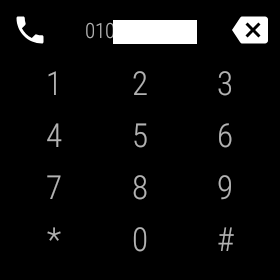
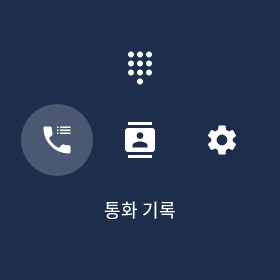

# Wear phone
Android Wear(현 Wear os)를 위한 전화부

 

## 개요
Android Wear 1.5버전에서는 별도의 전화부 어플리케이션을 기본 제공하지 않는다.  
홈 화면에서 오른쪽으로 스와이프하면 최근 연락한 일부 연락처가 표시되었지만 연결이 종료되면 사라지는 문제가 있었다.  

> 연락처가 없습니다. 휴대전화 주소록 앱에 연락처 추가  

음성을 통해 ~에게 전화 걸어줘와 같이 통화를 시작할 수 있지만 음성을 사용하지 못하는 경우에도 원활하게 전화를 걸 수 있는 어플리케이션이 필요하였다.  
특히 기존 Play Store에 출시된 전화부 어플리케이션들이 하위 버젼 지원을 중단하면서 새로운 전화부 어플리케이션 제작을 결심했다.  
새로운 전화부 어플리케이션으로 음성 명령을 사용하기 어려운 환경에서
다이얼 또는 연락처를 탐색하여 바로 전화를 걸 수 있다.

## 주요 기능
1. 다이얼 패드로 전화 걸기
2. 통화 기록 조회
3. 연락처 및 연락처 정보 조회

## 다이얼 패드
  

다이얼 패드를 이용하여 직접 전화 번호를 입력하여 통화할 수 있다.  
전화(통화) 권한이 필요하다.

## 통화 기록
   

통화기록을 조회할 수 있다.  
통화 기록 권한이 필요하다.  

## 연락처
  

연동된 연락처 목록을 조회하고 정보를 확인할 수 있다.  
연락처 권한이 필요하다.

## 설정, 권한

   
